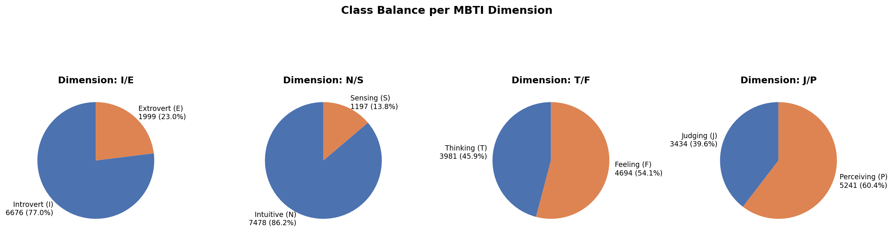
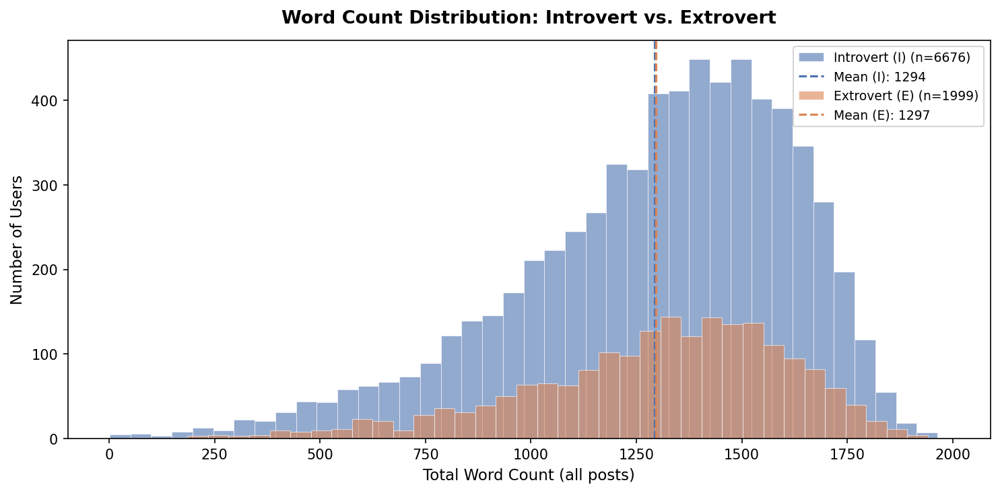
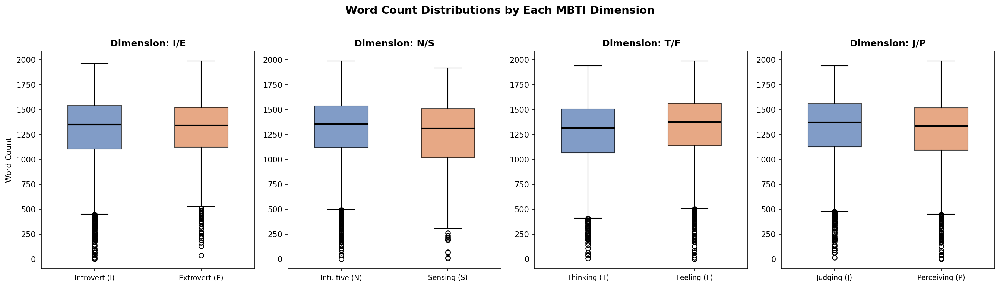
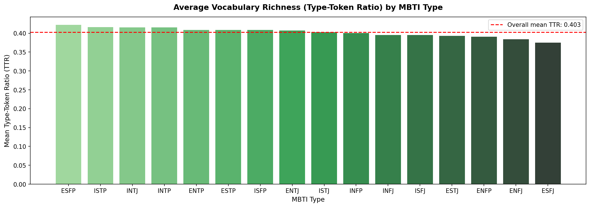

# IE 423 Term Project Proposal — Personality in Words: Mining Linguistic Fingerprints of MBTI Types

---

## Team Information

- [Feyza Bektaş - 121203057]
- [Jumana Asim Bakri Osman - 12203002]
- [Ali Fırat Dolu - 123203012]
- [Efe Odabaşı - 121203041]

---

## Dataset Description

We use the **(MBTI) Myers-Briggs Personality Type Dataset**, obtained from [Kaggle (datasnaek/mbti-type)](https://www.kaggle.com/datasets/datasnaek/mbti-type).

This dataset has been compiled with respective data provided by the **PersonalityCafe** forum, in which social media posts have been taken by users who also noted their Myers-Briggs Type Indicator (MBTI) personality type. Each row represents one user, where the user’s MBTI type is displayed alongside the text of their last 50 forum posts- they’re integrated through the ‘|||’ separator.

We chose to base our research on this dataset because it allows us to have an insightful perspective on the correlation  between **personality and writing style**; to add, looking at this dataset through a personal lens opts for a better understanding of the raw data, as opposed to controlled lab conditions or surveys. We believe that this form of kinesthetic communication helps us connect with the naturalistic language behaviour obtained from the users’ social media posts- this makes the ability to define personality dimensions suitable for NLP-based machine learning analysis.

| Property               | Details                            |
|------------------------|------------------------------------|
| **Number of rows**     | ~8,675 users                       |
| **Number of columns**  | 2 (`type`, `posts`)                |
| **Personality labels** | 16 MBTI types                      |
| **Dimensions**         | I/E, N/S, T/F, J/P                 |
| **Post format**        | Last 50 posts, separated by `\|\|\|` |
| **Language**           | English                            |

---

## Dataset Access

The dataset is stored (after download) in:

```
data/raw/mbti_1.csv
```

> **Note:** The dataset is not included in the repository due to file size. It must be downloaded manually.

**Download Instructions:**

1. Go to: [https://www.kaggle.com/datasets/datasnaek/mbti-type](https://www.kaggle.com/datasets/datasnaek/mbti-type)
2. Log in to Kaggle (free account required)
3. Click **Download**
4. Extract the zip file
5. Place `mbti_1.csv` inside `data/raw/`

For full details, see: [`data/README.md`](../data/README.md)

---

## Research Questions

### Research Question 1
**Which personality dimensions leave the strongest linguistic fingerprints in written text?**

**Explanation:**  
This research question focuses on decomposing the 16 MBTI personality types into their 4 independent binary pair classification criteria, contrary to just predicting the personality type solely from the forum posts. The 4 dichotomies found within the MBTI dimensions are the following: **I/E (Introversion vs. Extroversion), N/S (Intuition vs. Sensing), T/F (Thinking vs. Feeling), and J/P (Judging vs. Prospecting)**. For every dimension considered, we will assess the degree of classification difficulty, linguistic distinctiveness, and how reliably machine learning models can determine the binary classification type from text alone. The main indicators that will aid in our assessment include vocabulary differences, average sentence length, and use of specific word categories. For example, the I/E scope may create visual differences in text (e.g. introverts writing longer, reflective posts compared to the extroverted pattern of writing arbitrarily). All in all, determining which personality dimension is the most readable through text touches on both theoretical and practical implications. 

---

### Research Question 2
**Do different personality types exhibit different levels of linguistic consistency across their posts?**

**Explanation:**  
The aim of this research question is to navigate the variance in behavior between individual users across all stages of their writings. Instead of considering the linguistic profile of individual users as one entity, we will examine the variance in behavior exhibited by different personalities. We intend to determine if some personalities generate more consistent linguistic outputs than others that may have more variability in linguistic (tone and vocabulary) and content topics (various subjects written about) generated. Measures such as lexical richness (in terms of variability in the type/token ratio of postings), the variability in the sentiment of postings (in terms of standard deviation), and topic variability of postings will be considered. This is because this question investigates the basis behind using personality theories on NLP – that personality produces linguistic consistency.

---

### Research Question 3
**Can personality traits be inferred from writing style alone, independent of what topics a person discusses?**

**Explanation:**  
This question dives into the distinction between *what* people write about vs. *how* they write, determining if personality is a purely stylistic construct or is instead clouded by topical choices made by the user- depending on the context. The technique requires discarding or discounting those words that have a high topical load (e.g., nouns, proper nouns, specialized terms), and using exclusively stylistic aspects of language in analysis: function words, punctuation, variance in sentence length, use of hedges, and syntactic complexity.
To apply this, take the example of an introverted person who writes in a gaming discussion forum; they may use specialized language consistent with that used by another introverted person who writes in a forum on psychology; however, both may show similarities in terms of writing styles (examples include long sentences, complex sentences, fewer exclamation points). If personality can be spotted despite stripping away the context of the texts, then it will be possible to conclude that personality characteristics as measured through MBTI types are captured stylistically rather than in terms of content; we'd like to opt for a result that holds immense practical and theoretical significance.

---

## Project Proposal

For our project, we’d like to tackle the notion of whether personality dictates how we post.  We want to explore whether MBTI types leave identifiable linguistic fingerprints across social media. Using a specialized forum dataset as our foundation, we are building Natural Language Processing (NLP) models to determine if personality can be accurately predicted from digital communication.

Initially, we’d like to touch on the necessity of preprocessing and cleaning the dataset. We’d do this by removing URLs, MBTI type self mentions (which helps with preventing leakage), special characters, and noise. We also find it essential to standardize column names, as well as handling any missing values and split the concatenated post field into analyzable units. We’ll also be splitting the MBTI dimensions into 4 dichotomies (I/E, N/S, T/F, J/P) to support our focused analysis on the binary pair classification tasks.

Secondly, we will conduct exploratory data analysis to determine class imbalance issues, distribution of languages, and possible confounding factors. We will create graphs to show the type distributions, word count patterns, and vocabulary depth measurements.

As part of our take on our three research questions, we plan to adopt an overall strategy that encompasses text feature engineering (TF-IDF, style-based features, sentiment score calculation, and type-token ratio), binary classification modeling (logistic regression, random forest, and possibly support vector machines), as well as topic-style separation approaches (function words filtering and parts-of-speech analysis).

We aim not only at building the classifiers but at creating insights into the theoretical relation between personality and language. We want to evaluate what features are more visible in the texts, whether different types reveal their personality through their writing, and if their writing reveals characteristics about their personality at all.

Possible obstacles that we may encounter include the evident skew found in the 16 personality types, where an imbalance is detected in certain classes in the data (especially INFP individuals). Alongside this, the danger of circularity exists when references to MBTI types in the self-descriptions are not carefully filtered out. Also, the inherent philosophical difficulty in distinguishing between form and substance in natural language serves as an inevitable challenge that we will be facing in our project scope.

---

## Preprocessing Steps

### Step 1 — Loading the Data

The dataset was loaded using `scripts/01_load_data.py`.

The script checks whether `mbti_1.csv` exists in `data/raw/`. If not, it raises an informative error with download instructions. After successful loading, it prints the dataset shape, column names, data types, missing value counts, and a preview of sample rows.

**Output:**
- Dataset shape: 8,675 rows × 2 columns
- Columns: `type`, `posts`
- Missing values: 0 in both columns

---

### Step 2 — Standardizing Column Names and Types

Using `scripts/02_preprocess_data.py`:

- Column names were lowercased and stripped of whitespace
- The `type` column was uppercased to ensure consistent formatting (e.g., `infj` → `INFJ`)

---

### Step 3 — Removing Duplicates and Missing Values

Using `scripts/02_preprocess_data.py`:

- Exact duplicate rows were identified and removed
- Any rows with missing values in `type` or `posts` were dropped
- Row count was reported before and after to ensure transparency

---

### Step 4 — Splitting Posts and Computing Post Count

Each user's `posts` field contains up to 50 individual posts separated by `|||`.

Using `scripts/02_preprocess_data.py`:

- Posts were split into a list per user
- `post_count` column was added (number of valid posts per user)

Mean posts per user: ~50 (as expected from dataset design)

---

### Step 5 — Text Cleaning

Using `scripts/02_preprocess_data.py`:

The `clean_text()` function applies the following transformations:

| Step | Operation |
|------|-----------|
| 1 | Remove URLs (`http://`, `www.`) |
| 2 | Remove MBTI type mentions (e.g., `INFJ`, `ENTP`) — **critical to prevent label leakage** |
| 3 | Remove special characters and digits |
| 4 | Normalize whitespace and lowercase text |

The cleaned text is stored in the `clean_posts` column.

---

### Step 6 — Creating Binary Dimension Columns

Using `scripts/02_preprocess_data.py`:

Four binary label columns were created from the `type` field:

| Column  | 0 (negative class) | 1 (positive class) |
|---------|--------------------|--------------------|
| `dim_IE` | Introvert (I)      | Extrovert (E) |
| `dim_NS` | Intuitive (N)      | Sensing (S) |
| `dim_TF` | Thinking (T)       | Feeling (F) |
| `dim_JP` | Judging (J)        | Perceiving (P) |

These columns allow each dimension to be analyzed independently as a binary classification problem.

---

### Step 7 — Basic Linguistic Feature Computation

Using `scripts/02_preprocess_data.py`:

Three numerical features were computed from `clean_posts`:

| Feature       | Description |
|---------------|-------------|
| `word_count`  | Total number of words across all posts |
| `char_count`  | Total character count |
| `avg_word_len`| Average length of words (char_count / word_count) |

---

### Step 8 — Saving Processed Data

The cleaned and feature-enriched dataset was saved to:

```
data/processed/mbti_cleaned.csv
```

**Columns saved:** `type`, `dim_IE`, `dim_NS`, `dim_TF`, `dim_JP`, `clean_posts`, `post_count`, `word_count`, `char_count`, `avg_word_len`

---

## Initial Outputs

All outputs below are generated by `scripts/03_basic_eda.py`.

---

### Figure 1 — MBTI Type Distribution

> Generated by: `scripts/03_basic_eda.py` → saved to `outputs/figures/fig1_type_distribution.png`


The dataset shows significant **class imbalance**. Type INFP is the most common (~1,832 users), while ESFJ is the rarest (~42 users). This imbalance is a known characteristic of this dataset and must be addressed in modeling (e.g., via class weighting or resampling).

---

### Figure 2 — Class Balance per MBTI Dimension

> Generated by: `scripts/03_basic_eda.py` → saved to `outputs/figures/fig2_dimension_balance.png`



Across all four binary dimensions, the dataset shows strong imbalance — particularly in the N/S dimension, where **Intuitive (N)** types dominate. This reflects the self-selection bias of online personality forums.

---

### Figure 3 — Word Count Distribution by I/E Dimension

> Generated by: `scripts/03_basic_eda.py` → saved to `outputs/figures/fig3_wordcount_IE.png`



Introverts (I) and Extroverts (E) appear to show slightly different word count distributions. Introverts tend to write more words overall, which aligns with the hypothesis that introversion correlates with more elaborate written self-expression.

---

### Figure 4 — Word Count Boxplots per Dimension

> Generated by: `scripts/03_basic_eda.py` → saved to `outputs/figures/fig4_wordcount_boxplots.png`



Boxplots show the spread of word counts across both poles of each of the four MBTI dimensions. Notable differences in median and spread can be observed, supporting the hypothesis that writing volume is not uniformly distributed across personality types.

---

### Figure 5 — Vocabulary Richness by MBTI Type

> Generated by: `scripts/03_basic_eda.py` → saved to `outputs/figures/fig5_vocabulary_richness.png`



**Type-Token Ratio (TTR)** measures vocabulary diversity: higher TTR means a wider variety of words used relative to total words. This initial visualization suggests that some MBTI types exhibit notably higher vocabulary richness than others — a signal that may be relevant to our research questions on linguistic consistency and stylistic fingerprints.

---

### Missing Value Summary

> Generated by: `scripts/02_preprocess_data.py` → saved to `outputs/tables/missing_value_summary.csv`

| Column      | Missing Count | Missing % |
|-------------|--------------|-----------|
| type        | 0            | 0.00      |
| posts       | 0            | 0.00      |
| clean_posts | 0            | 0.00      |

No missing values were found. The dataset is complete.

---

## How to Run the Project

### 1. Clone the repository

```bash
git clone [your-repository-link]
cd [repository-name]
```

### 2. Install required packages

```bash
pip install -r requirements.txt
```

### 3. Place the dataset

Download `mbti_1.csv` from Kaggle (see [`data/README.md`](../data/README.md)) and place it here:

```
data/raw/mbti_1.csv
```

### 4. Run the scripts in order

```bash
python scripts/01_load_data.py
python scripts/02_preprocess_data.py
python scripts/03_basic_eda.py
```

All outputs (figures and tables) will be automatically saved to `outputs/`.

---

## Transparency and Traceability

All outputs presented in this markdown file are generated from the Python scripts in the `scripts/` folder.

| Output | Source Script |
|--------|--------------|
| `outputs/figures/fig1_type_distribution.png` | `scripts/03_basic_eda.py` |
| `outputs/figures/fig2_dimension_balance.png` | `scripts/03_basic_eda.py` |
| `outputs/figures/fig3_wordcount_IE.png` | `scripts/03_basic_eda.py` |
| `outputs/figures/fig4_wordcount_boxplots.png` | `scripts/03_basic_eda.py` |
| `outputs/figures/fig5_vocabulary_richness.png` | `scripts/03_basic_eda.py` |
| `outputs/tables/missing_value_summary.csv` | `scripts/02_preprocess_data.py` |
| `outputs/tables/type_distribution.csv` | `scripts/02_preprocess_data.py` |
| `outputs/tables/linguistic_summary_by_type.csv` | `scripts/03_basic_eda.py` |
| `data/processed/mbti_cleaned.csv` | `scripts/02_preprocess_data.py` |

The repository is designed so that any user can reproduce the same outputs by:
1. Installing the required packages listed in `requirements.txt`
2. Placing `mbti_1.csv` in `data/raw/`
3. Running the three scripts in order
